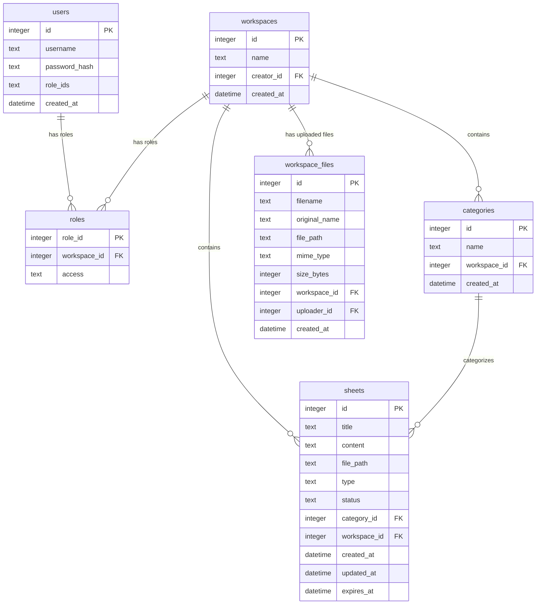

# SyncPad (Shared Real-time Workspace Clipboard)

> [!IMPORTANT]
> **SyncPad** is a web-based, real-time shared clipboard that allows collaborative text editing, category organization, file sharing, and role-based access management. This repository acts as a unified parent wrapper coordinating the frontend client and backend server as Git submodules.

<p align="center">
  <strong>Real-time WS Sync</strong> &bull;
  <strong>Collaborative Locking</strong> &bull;
  <strong>Workspace File Drive</strong> &bull;
  <strong>Admin DB Explorer</strong>
</p>

<p align="center">
  <strong>Live Production URL:</strong> <a href="https://projects.satishg.in/syncpad" target="_blank">projects.satishg.in/syncpad</a>
</p>

---

## Table of Contents

- [System Architecture](#system-architecture)
- [Key Features](#key-features)
  - [Collaborative Locking & Syncing](#collaborative-locking--syncing)
  - [Workspace Drive (File Sharing)](#workspace-drive-file-sharing)
  - [Admin Dashboard](#admin-dashboard)
- [Submodule Repositories](#submodule-repositories)
- [Local Development Setup](#local-development-setup)
  - [Prerequisites](#prerequisites)
  - [Step 1: Clone the Repository](#step-1-clone-the-repository)
  - [Step 2: Configure Environment Variables](#step-2-configure-environment-variables)
  - [Step 3: Run the Application](#step-3-run-the-application)
- [Automated Sync Pipeline](#automated-sync-pipeline)
- [Tech Stack Overview](#tech-stack-overview)
- [Database Schema](#database-schema)

---

## System Architecture

The parent repository wraps the application frontend and backend, enabling unified version tracking, rapid deployment orchestration, and seamless developer onboarding.

```
                      +---------------------------------------+
                      |         sync-pad (Parent Repo)        |
                      +-------------------+-------------------+
                                          |
                     +--------------------+--------------------+
                     |                                         |
                     v                                         v
         +-----------+-----------+                 +-----------+-----------+
         |     client/ submodule  |                 |     server/ submodule  |
         | (React 19 + Vite 8 UI)|                 | (Express + Socket.io) |
         +-----------+-----------+                 +-----------+-----------+
                     |                                         |
                     | (HTTP Requests & Cookies)               | (Websocket Events)
                     +--------------------+--------------------+
                                          v
                                 [(SQLite Database)]
```

---

## Key Features

### Collaborative Locking & Syncing

To prevent concurrent editing conflicts on the same shared clipboard (sheet), SyncPad implements a reactive WebSocket-driven lock ownership protocol:

* **Lock Assignment**: The first user to open a sheet is assigned the lock ownership (`🟢 Editing` mode).
* **Read-Only Lockout**: Concurrent viewers see a disabled editor with a `🔒 Read-Only` status badge and hidden toolbars.
* **Lock Takeover**: Users can click `[Take Control]` to request a lock transfer. The backend reassigns the lock to the requesting socket, instantly updating all client sessions.
* **Autofocus Preserver**: Custom React DOM reference keys ensure that cursor positions and scroll states are preserved when remote edits update the text.

### Workspace Drive (File Sharing)

Each workspace includes a local, authenticated storage drive:
* **Drag-and-Drop Uploader**: Direct upload using HTML5 handlers and multipart Form-Data.
* **Dynamic Re-indexing**: Active uploads/deletions trigger real-time updates across all connected clients in the workspace via WebSocket broadcasts.
* **Secure Streaming**: Files are served via token-validated streaming routes to ensure only authorized workspace members can download assets.

### Admin Dashboard

Includes direct database management and governance capabilities:
* **DB Explorer**: Inspects and queries SQLite database tables directly in a paginated grid.
* **User & Roles Manager**: Modifies workspace access mappings and overrides user permission schemas.
* **Workspaces Manager**: Creates new workspaces and regulates active user memberships.

---

## Submodule Repositories

This repository contains two submodules:

1. **[client](file:///c:/Users/satis/Music/sync-pad/master/sync-pad/client)**: React single-page application built with Vite, React Quill, and Socket.io Client.
2. **[server](file:///c:/Users/satis/Music/sync-pad/master/sync-pad/server)**: Express server serving REST endpoints, executing Socket.io namespaces, and managing SQLite & local disk storage.

---

## Local Development Setup

### Prerequisites

* **Node.js** (v18.x or higher)
* **npm** (v9.x or higher)

### Step 1: Clone the Repository

Clone the parent repository along with its submodules recursively:

```bash
git clone --recursive https://github.com/YOUR_GITHUB_USERNAME/sync-pad.git
cd sync-pad
```

If you have already cloned the repository without submodules, fetch them using:

```bash
git submodule update --init --recursive
```

### Step 2: Configure Environment Variables

#### 1. Server Configuration
Navigate to the `server/` directory, copy `.env.example`, and configure the backend:

```bash
cd server
cp .env.example .env
```

```ini
PORT=5000
DATABASE_URL=database.db
JWT_SECRET=your_jwt_secret_key_here
COOKIE_SECRET=your_cookie_secret_here
CORS_ORIGIN=http://localhost:5173
```

#### 2. Client Configuration
Navigate to the `client/` directory, copy `.env.example`, and configure the frontend:

```bash
cd ../client
cp .env.example .env
```

```ini
VITE_API_URL=http://localhost:5000/syncpad
VITE_WS_URL=http://localhost:5000/syncpad
```

### Step 3: Run the Application

#### 1. Start Backend Server
```bash
cd ../server
npm install
npm run dev
```
*The server will start at `http://localhost:5000`.*

#### 2. Start Frontend Dev Server
```bash
cd ../client
npm install
npm run dev
```
*The React app will launch at `http://localhost:5173`.*

---

## Automated Sync Pipeline

To keep the parent repository pointing to the latest releases of the `client` and `server` repositories, a GitHub Actions workflow executes daily at **midnight UTC**:

- **Location**: `.github/workflows/sync-submodules.yml`
- **Actions**:
  1. Pulls the latest commits from the remote branches of the submodules.
  2. Detects pointer changes.
  3. Commits the new submodule references using the `github-actions[bot]` user.
  4. Pushes changes directly to the `main` branch.


---

## Tech Stack Overview

| Component | Technology | Purpose |
| :--- | :--- | :--- |
| **Frontend** | React 19, Vite 8, React Router 7 | Core UI, modular components, and frontend routing |
| **Rich Editor** | React Quill New 3 | WYSIWYG text interface |
| **Backend** | Express 4, Node.js | REST APIs, route controllers, and middlewares |
| **Sockets** | Socket.io 4 | Real-time workspace rooms and lock synchronization |
| **Database** | SQLite3 | Local server-side data storage |
| **Authentication** | JSON Web Tokens (JWT) | Secure stateless HttpOnly cookie sessions |

---

## Database Schema


